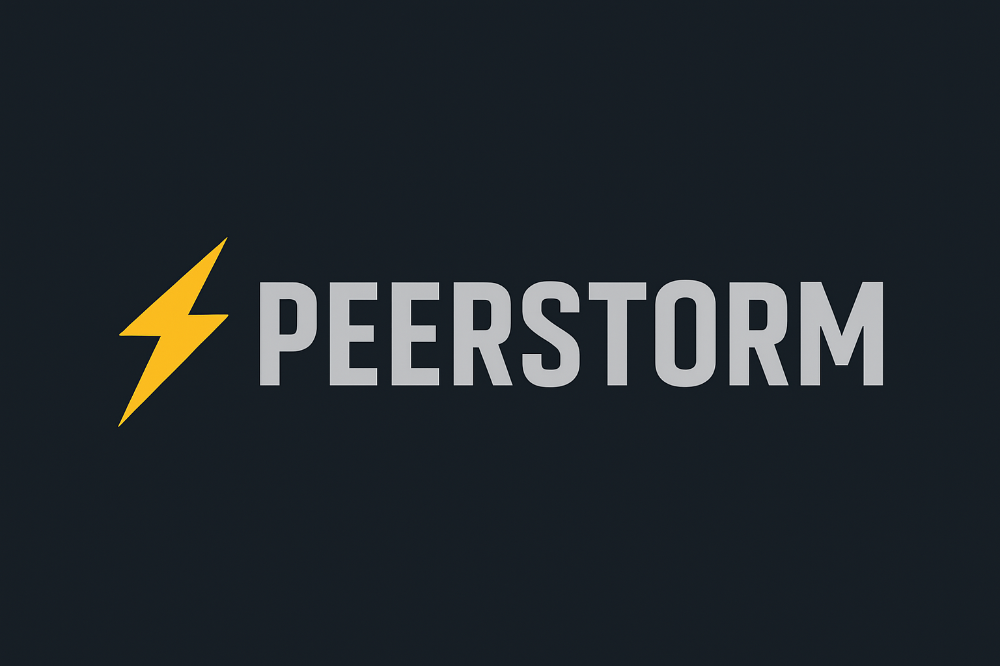

# **PeerStorm – A Modern BitTorrent Client (In Development)**


PeerStorm is a modern, lightweight BitTorrent client written in **C++17**.  
Its goal is to fully support:
- `.torrent` file parsing  
- Magnet link parsing  
- Bencode decoding  
- Info dictionary hashing  
- CLI-based metadata display  

⚠️ **Note:** PeerStorm is currently **in heavy development** and is **NOT a usable torrent client yet**.  
Right now, only metadata parsing and hashing are implemented.

---

## 🚀 Features (Current)

✔️ Bencode decoder  
✔️ `.torrent` file parser  
✔️ Extracts and displays torrent metadata  
✔️ SHA-1 hashing support  
✔️ infohash calculation  
✔️ Cross-platform C++17  
✔️ Simple CLI interface  

---

## 🛠️ Project Status

This repository is **work in progress**.  
The code currently allows you to:

- Load a `.torrent` file  
- Decode the bencode structure  
- Extract metadata  
- Compute SHA-1 / SHA-256 / hybrid infohash  

**Currently being developed:**

- Tracker communication  
- Peer-to-peer protocol  
- Piece downloading logic  
- DHT support  
- File storage engine  

---

## 🔧 Build Instructions

### **Prerequisites**
- C++17 compiler (GCC, Clang, or MSVC)
- CMake (optional but recommended)
- Make/Ninja or IDE like CLion / VS Code

### **Build using g++**
```sh
g++ -std=c++17 -Iinclude main.cpp src/parser.cpp src/bencode.cpp src/sha1.cpp -o PeerStorm
