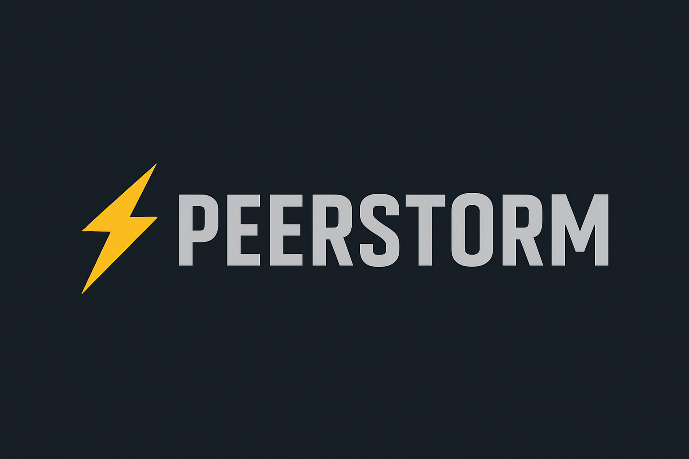

# **PeerStorm – A Modern BitTorrent Client (In Development)**


PeerStorm is a **serious, low-level BitTorrent client** written in **modern C++17**, built from scratch to deeply understand and implement the BitTorrent protocol stack.

The project focuses on **correctness, protocol-level clarity, and extensibility**, rather than being a quick wrapper around existing libraries.

⚠️ **IMPORTANT:** PeerStorm is still **under active development** and is **not yet a complete downloader**.  
However, tracker communication is now partially functional.

---

## 🚀 Features (Implemented)

### ✅ Core
- Bencode decoder (fully functional)
- `.torrent` file parser
- Torrent metadata extraction
- Info dictionary hashing (SHA-1)
- Magnet hash compatibility
- Clean CLI-based metadata display
- Cross-platform C++17 codebase

### ✅ Tracker Support (NEW)
- **HTTP tracker announce support**
- **UDP tracker announce support**
- Compact peer list parsing
- Multiple trackers from `announce-list`
- Verbose debug output for tracker communication
- Windows Winsock networking support

---

## 🧪 What Works Right Now

You can currently:

- Load a `.torrent` file
- Decode and inspect its bencode structure
- View torrent metadata (files, size, pieces, trackers)
- Compute and display the info-hash
- Contact **HTTP trackers**
- Contact **UDP trackers**
- Receive and parse **peer lists**

Example:
```bash
PeerStorm add-torrent example.torrent
